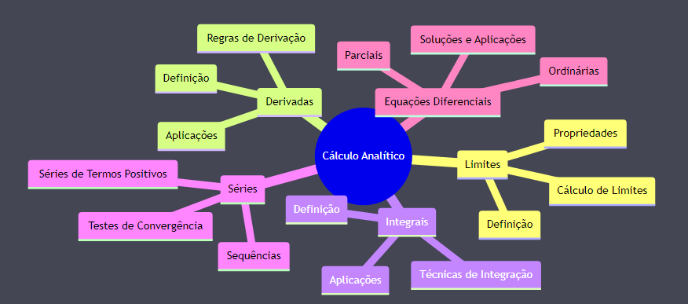
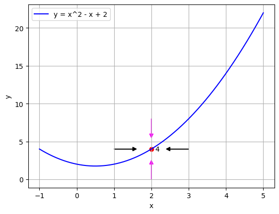
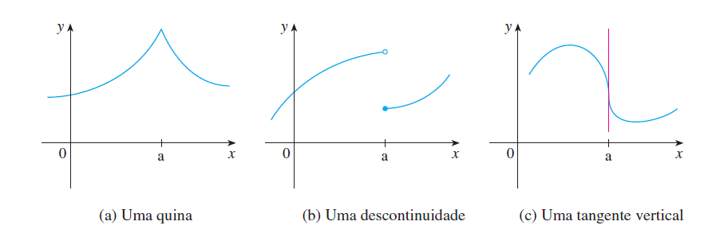
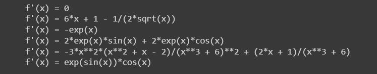

1. **Derivadas analíticas e definições**
========================================

O primeiro capítulo deste material tem como objetivo retomar alguns conceitos básicos de cálculo, como limites e derivadas,  
de modo a garantir que todos que tiverem acesso ao material relembrem das principais técnicas de derivação analítica e aplicações de limites, 
garantindo assim, que ao adentrarmos nos próximos capítulos  o estudante possa retornar a esta seção e sanar ocasionais dúvidas.
Um curso de cálculo é rico em detalhes, demonstrações e normalmente é acompanhado por diversas disciplinas como cálculo 1, 2, 3, 4, geometria analítica e 
algebra linear e, este material não tem como objetivo adentrar em todos os possíveis tópicos que tangem o tema.
A extensão dos conteúdos transcende os objetivos deste material, a imagem abaixo ilustra uma porção de conteúdos cobrados no ciclo básico de uma graduação em física, por exemplo.

    Figura 0 

1.1. **A definição de limite e suas propriedades**
--------------------------------------------------

A principal motivação para se entender o limite de uma função se dá devido ao estudo do comportamento de uma função matemática
à medida que sua variável independente (geralmente denotada pela letra :math:`x` ) se aproxima de um determinado valor.
Podemos definir o limite de uma função da seguinte maneira:

.. admonition:: Definição

        Suponha que a função :math:`f(x)` seja bem definida em uma dada região próxima a vizinhança de :math:`a` . Podemos escrever que:

        .. math::

            \displaystyle\lim_{{x \to a}} f(x) = L \tag{1}

        Dizemos que o limite de :math:`f(x)` quando :math:`x` tende à :math:`a` é igual a :math:`L`.

O que isso quer dizer na prática?
    
Quanto mais aproximamos o valor de :math:`x` para :math:`a` (lateralmente pela direita ou pela esquerda) a função :math:`f(x)`
pode se tornar tão próxima quanto quisermos de :math:`L`.

A Figura 1 apresentada abaixo simboliza um exemplo em que a função :math:`x^2 - x + 2` tende a :math:`4` quando :math:`x` tende a :math:`2`.

    Figura 1

1.1.1. **Limites laterais**
~~~~~~~~~~~~~~~~~~~~~~~~~~~
No estudo de limites, muitas vezes queremos saber como uma função se comporta à medida que a variável independente se aproxima de um 
determinado valor por um lado específico, seja pela esquerda ou pela direita. É aqui que entra o conceito de limites laterais.

.. admonition:: Definição

    O limite da função :math:`f(x)` quando :math:`x` se aproxima do número :math:`a` pelo lado esquerdo é denotado por:

    .. math::

        \lim_{{x \to a^-}} f(x) \tag{2}
    

    E é chamado de limite lateral à esquerda.

    O limite da função :math:`f(x)` quando :math:`x` se aproxima do número :math:`a` pelo lado direito é denotado por:

    .. math::

        \lim_{{x \to a^+}} f(x) \tag{3}

    E é chamado de limite lateral à direita.

    Para que o limite de uma função exista em um determinado ponto :math:`a`, os limites laterais à esquerda e à direita devem ser iguais e finitos. 
    Em outras palavras:

    .. math::

        \lim_{{x \to a}} f(x) = L \Leftrightarrow \lim_{{x \to a^-}} f(x) = \lim_{{x \to a^+}} f(x) = L \tag{4}

Vamos considerar o exemplo abaixo para ilustrar o conceito.

Imagine a função definida por:

.. math::

    f(x) =
    \begin{cases}
        x^2 & \text{se } x < 2

        4 & \text{se } x > 2
    \end{cases}

Repare que a função não é definida no ponto :math:`x=2` , gerando o que chamamos de singularidade, ou seja,
uma indeterminação no ponto.

Podemos visualizar o exemplo acima dentro de um ambiente que tenha suporte a linguagem Python.

.. admonition:: Exemplo

    Tente rodar o código abaixo em um ambiente Python e veja se o gráfico obtido é parecido com o apresentado abaixo.

    Entrada:

    .. code::

        # Importando as bibliotecas necessárias
        import numpy as np
        import matplotlib.pyplot as plt

        # Definindo a função f(x)
        def f(x):
            # Se x for menor que 2, retorna o quadrado de x
            if x < 2:
            return x*x
            # Caso contrário, retorna 4
            else:
                return 4

        # Gerando valores de x para plotar o gráfico

        # x1 contém 500 valores linearmente espaçados entre 0 e 1.98 (um valor próximo mas abaixo de 2)
        x1 = np.linspace(0, 1.98, 500)

        # x2 contém 500 valores linearmente espaçados entre 2.080 (um valor próximo mas acima de 2) e 5
        x2 = np.linspace(2.080, 5, 500)

        # Usando a função f(x) definida anteriormente para gerar os valores y correspondentes para cada x em x1
        y1 = [f(val) for val in x1]

        # Usando a função f(x) para gerar os valores y correspondentes para cada x em x2
        y2 = [f(val) for val in x2]

        # Plotando o gráfico da função para o intervalo de x1
        plt.plot(x1, y1, 'b', label="f(x)")

        # Plotando o gráfico da função para o intervalo de x2
        plt.plot(x2, y2, 'b')

        # Adicionando um ponto no gráfico em x=2, y=4 com cor vermelha e sem preenchimento para indicar a descontinuidade
        plt.scatter([2], [4], color='red', s=50, facecolors='none', edgecolors='r', label="Indefinido em x=2")

        # Nomeando os eixos x e y
        plt.xlabel("x")
        plt.ylabel("y")

        # Adicionando uma legenda ao gráfico
        plt.legend()

        # Optando por não mostrar as linhas de grade
        plt.grid(False)

        # Exibindo o gráfico
        plt.show()

    Saída:

    .. figure:: images/image_2.png
        :align: center

        Figura 2
        

Com o gráfico plotado podemos visualizar os limites laterais para a função definida acima:

O limite lateral à esquerda de :math:`f(x)` quando :math:`x` se aproxima de 2 é

.. math::

    \lim_{{x \to 2^-}} f(x) = 2^{2} = 4

O limite lateral à direita de :math:`f(x)` quando :math:`x` se aproxima de 2 é

.. math::

    \lim_{{x \to 2^+}} f(x) = 4

Uma vez que os limites laterais são iguais, o limite de :math:`f(x)` quando :math:`x` se aproxima de 2 é 4.

Limites laterais são essenciais para entender o comportamento de funções em pontos de descontinuidade ou em pontos onde 
a função tem um comportamento "quebrado". Eles também são úteis para determinar a existência de assimptotas 
verticais e para compreender o comportamento de funções em intervalos abertos.

Em resumo, limites laterais fornecem uma ferramenta poderosa para examinar o comportamento local de uma função à medida que
a variável independente se aproxima de um valor específico a partir de uma direção particular.

1.1.2. **Limites infinitos**
~~~~~~~~~~~~~~~~~~~~~~~~~~~~

Frequentemente nos deparamos com funções que, em determinados pontos, "explodem" para valores muito grandes (positivos ou negativos).
Nesses casos, dizemos que o limite da função é infinito naquele ponto específico.

.. admonition:: Definição

        .. math::
                
            \displaystyle \lim_{x \to a} f(x) = \infty \tag{5}

        Podemos fazer os valores de :math:`f(x)` ficarem tão grandes quanto quisermos de modo que :math:`x` fique tão próximo, mas não igual a :math:`a`.

        Dizemos que o limite de :math:`f(x)` quando :math:`x` tende à :math:`a` é igual a :math:`\infty`.

        A mesma definição é válida para quando a função tende para um valor suficientemente pequeno:

        Suponha que a função :math:`f(x)` seja bem definida em uma dada região próxima a vizinhança de :math:`a` , exceto no próprio :math:`a`, então

        .. math::
                
            \displaystyle \lim_{x \to a} f(x) = - \infty \tag{6}

        Podemos fazer os valores de :math:`f(x)` ficarem tão pequenos quanto quisermos de modo que :math:`x` fique tão próximo, mas não igual a :math:`a`.

        Dizemos que o limite de :math:`f(x)` quando :math:`x` tende à :math:`a` é igual a :math:`-\infty`.

Vamos considerar o exemplo abaixo para ilustrar o conceito.

Queremos estudar o comportamento da função :math:`f(x) = \frac{1}{x^2}` quando :math:`x` tende à :math:`0`.

Como disponibilizamos de recursos computacionais, podemos plotar o gráfico em um ambiente Python.

.. admonition:: Exemplo

    Entrada:
    
    .. code::

        # Importando as bibliotecas necessárias
        import numpy as np
        import matplotlib.pyplot as plt

        # Definindo a função f(x)
        def f(x):
            # Retorna o valor de 1 dividido pelo quadrado de x
            return 1/x**2

        # Gerando os valores de x para o gráfico

        # x1 contém 500 valores linearmente espaçados entre -10 e -0.01 
        # Isso é usado para evitar a descontinuidade em x=0 e cobre o intervalo à esquerda de x=0
        x1 = np.linspace(-10, -0.01, 500)

        # x2 contém 500 valores linearmente espaçados entre 0.01 e 10 
        # Novamente, isso evita a descontinuidade em x=0 e cobre o intervalo à direita de x=0
        x2 = np.linspace(0.01, 10, 500)

        # Plotando a função para o conjunto de valores x1 e x2
        plt.plot(x1, f(x1), 'b-')
        plt.plot(x2, f(x2), 'b-', label = 'f(x)')

        # Definindo os limites para o eixo y, de modo que os valores de y fiquem entre 0 e 10
        plt.ylim(0, 10)

        # Definindo os limites para o eixo x, de modo que os valores de x fiquem entre -5 e 5
        plt.xlim(-5, 5)

        # Nomeando os eixos x e y
        plt.xlabel("x")
        plt.ylabel("y")

        # Adicionando uma legenda ao gráfico, que irá mostrar 'f(x)'
        plt.legend()
        plt.grid(False)
        plt.show()

    Saída:
    
    .. figure:: images/image_3.png

        Figura 3

Ao observarmos o gráfico e as definições acima, podemos concluir que:

.. math::

    \displaystyle \lim_{x \to 0} \frac{1}{x^2} = \infty

É importante lembrar que o termo :math:`\infty` não é um número de fato e representa apenas que este valor cresce indefinidamente conforme
:math:`x` tende à :math:`0`.

1.1.3. **Limites no infinito**
~~~~~~~~~~~~~~~~~~~~~~~~~~~~~~

Frequentemente nos deparamos com funções que, à medida que suas variáveis se aproximam do infinito (positivo ou negativo), tendem a se
estabilizar em determinados valores. Nesses casos, estamos interessados em entender como se dá o comportamento dessas funções para valores muito grandes 
ou muito pequenos de :math:`x`.

.. admonition:: Definição

    À medida que :math:`x` cresce para valores muito grandes (aproximando-se do infinito), :math:`f(x)` tende ao valor :math:`L`.

    Dizemos que o limite de :math:`f(x)` quando :math:`x` tende ao infinito é :math:`L`.

    Em outras palavras:

    .. math::
        
        \displaystyle \lim_{x \to \infty} f(x) = L \tag{7}

    Analogamente, à medida que :math:`x` decresce indefinidamente (aproximando-se do infinito negativo), :math:`f(x)` tende ao valor :math:`L`.

    Dizemos que o limite de :math:`f(x)` quando :math:`x` tende ao infinito negativo é :math:`L`.

    Em outras palavras:

    .. math::
            
        \displaystyle \lim_{x \to -\infty} f(x) = L \tag{8}

Relacionado a este comportamento de aproximação, temos o conceito de retas assíntotas. Uma reta assíntota é uma linha reta à qual uma 
curva se aproxima à medida que a variável independente da curva se aproxima do infinito ou de algum valor específico. A ideia é que, mesmo 
que a curva nunca toque realmente a reta assíntota, ela continuará a se aproximar da reta indefinidamente. Existem três tipos principais de 
assíntotas: horizontal, vertical e oblíqua (ou inclinada).

.. admonition:: Definição: Assíntotas verticais

    A reta :math:`x = a` é chamada de assintota vertical da curva :math:`y=f(x)` se pelo menos uma das condições abaixo estiverem satisfeitas:

    .. list-table::
       :widths: 45 45

       * - :math:`1. \displaystyle \lim_{x \to a} f(x) = \infty`
         - :math:`2. \displaystyle \lim_{x \to a} f(x) = -\infty`
       * - :math:`3. \displaystyle \lim_{x \to a^{-}} f(x) = \infty`
         - :math:`4. \displaystyle \lim_{x \to a^{-}} f(x) = -\infty`
       * - :math:`5. \displaystyle \lim_{x \to a^{+}} f(x) = \infty`
         - :math:`6. \displaystyle \lim_{x \to a^{+}} f(x) = -\infty`

    
.. admonition:: Definição: Assíntotas horizontais

    A reta :math:`y = L` é chamada de assíntota horizontal da curva :math:`y = f(x)` se:

    .. math:: 

        \begin{align}
        &\displaystyle \lim_{x \to \infty} f(x) = L \tag{9} \\ \\
        &\displaystyle \lim_{x \to -\infty} f(x) = L \tag{10} \\ \\
        \end{align}

Vamos ilustrar as definições apresentadas acima através do exemplo abaixo:

Encontre as assíntotas verticais da função a seguir :math:`f(x) = \frac{(x^2 + 1)}{3x - 2x^2}` e através dos recursos gráficos mostre 
se o seu limite existe ou não, quando :math:`x \to 0` e quando :math:`x \to 1.5` .

.. admonition:: Exemplo

    Entrada:

    .. code:: 

        # Importando as bibliotecas necessárias para cálculos numéricos e visualização gráfica
        import numpy as np
        import matplotlib.pyplot as plt

        # Definindo a função matemática a ser plotada
        def f(x):
            return (x**2 + 1) / (3*x - 2*x**2)

        # Segmentando os valores de x para evitar singularidades (divisões por zero ou valores indefinidos)
        # Definindo o segmento à esquerda da primeira assíntota
        x_left = np.linspace(-10, -0.01, 500)
        # Definindo o segmento entre as duas assíntotas
        x_mid = np.linspace(0.01, 1.49, 500)
        # Definindo o segmento à direita da segunda assíntota
        x_right = np.linspace(1.51, 10, 500)

        # Calculando os valores correspondentes de y para cada segmento de x
        y_left = f(x_left)
        y_mid = f(x_mid)
        y_right = f(x_right)

        # Adicionando assíntotas verticais com linhas tracejadas
        # Assíntota em x = 0 colorida de vermelho
        plt.axvline(x=0, color='r', linestyle='--', label='Assíntota x = 0')
        # Assíntota em x = 1.5 colorida de verde
        plt.axvline(x=1.5, color='g', linestyle='--', label='Assíntona x = 1.5')

        # Plotando a função para cada segmento de x em azul
        plt.plot(x_left, y_left, 'b')
        plt.plot(x_mid, y_mid, 'b')
        plt.plot(x_right, y_right, 'b', label = "f(x)")

        # Definindo os rótulos dos eixos x e y
        plt.xlabel("x")
        plt.ylabel("y")

        # Limitando os valores dos eixos para uma melhor visualização do gráfico
        plt.ylim([-30, 30])  # Eixo y limitado entre -30 e 30
        plt.xlim([-5, 5])    # Eixo x limitado entre -5 e 5

        plt.grid(False)
        plt.legend()
        plt.show()
    
    Saída:
    
    .. figure:: images/image_4.png

        Figura 4

Repare que a função apresentada no exemplo acima possui duas assintotas verticais além de duas singularidades em seu domínio (:math:`x = 0 \text{ e } x = 1.5`). 
Podemos encontrar os limites laterais simplesmente ao analisarmos o gráfico.

Quando :math:`x \to 0^{-}` , :math:`f(x) \to -\infty` e quando :math:`x \to 0^{+}` , :math:`f(x) \to \infty` nos mostrando que os limites laterais
são diferentes e portanto o limite da função não existe em :math:`x = 0` .

Quando :math:`x \to 1.5^{-}` , :math:`f(x) \to \infty` e quando :math:`x \to 1.5^{+}` , :math:`f(x) \to -\infty` nos mostrando que os limites laterais
são diferentes e portanto o limite da função não existe em :math:`x = 1.5` .

Encontre as assíntotas horizontais da função a seguir :math:`f(x) = \frac{(x^2 - 1)}{(x^2 + 1)}` e através dos recursos gráficos mostre 
se o seu limite existe ou não, quando :math:`x \to \infty`  .

.. admonition:: Exemplo

    Entrada:

    .. code:: 

        # Importando as bibliotecas necessárias para cálculos numéricos e visualização gráfica
        import numpy as np
        import matplotlib.pyplot as plt

        # Definindo a função matemática a ser plotada
        def f(x):
            return ((x*x - 1)/(x*x + 1))

        # Gerando os valores de x para o gráfico
        x = np.linspace(-10, 10, 500)

        # Calculando os valores correspondentes de y 
        y = f(x)

        # Adicionando assíntotas horizontais em vermelho
        plt.axhline(y = 1, color='r', linestyle='--', label='Assíntota y = 1')

        # Plotando a função em azul
        plt.plot(x, y, 'b', label = "f(x)")

        # Definindo os rótulos dos eixos x e y
        plt.xlabel("x")
        plt.ylabel("y")

        # Limitando o eixo y para ver o comportamento da função
        plt.ylim([-2, 2])  
        plt.xlim([-8, 8])

        plt.grid(False)
        plt.legend()
        plt.show()

    
    Saída:

    .. figure:: images/image_5.png

        Figura 5

Repare que a função apresentada no exemplo acima possui uma assintotas horizontal em (:math:`y = 1`). 
Podemos encontrar o limite simplesmente ao analisarmos o gráfico.

Quando :math:`x \to \infty` , notamos que :math:`f(x) \to 1` , 
indicando que o limite da função existe e é igual a 1.

Podemos escrever que:

.. math:: 

    \begin{align}
    &\displaystyle \lim_{x \to \infty} \frac{(x^2 - 1)}{(x^2 + 1)} = 1 \\ \\
    \end{align}

A importância de se encontrar as assíntotas verticais e horizontais se dá exatamente na análise gráfica de funções descontínuas e complicadas, mas nem sempre é fácil de 
plotarmos um gráfico. 
Como você pode ter percebido, conforme as descontinuidades se tornam mais presentes, os gráficos vão se tornando mais elaborados devido à complexidade
em se segmentar o domínio da função de forma coerente com a linguagem de programação utilizada.

Podemos então utilizar de argumentos matemáticos para calcularmos o limite de qualquer função matemática e, por isso, a próxima subseção vem para nos munir de
propriedades que regem o cálculo de limites, não nos deixando tão dependentes da análise gráfica em si.

1.1.4. **Propriedades de limites** 
~~~~~~~~~~~~~~~~~~~~~~~~~~~~~~~~~~

Iremos definir abaixo as principais propriedades para cálculo de limites levando em consideração que :math:`c` seja uma constante. 
:math:`f(x)` e :math:`g(x)` sejam funções definidas na vizinhança de :math:`a`, ou seja:

.. math::

    \begin{align}
    &\displaystyle \lim_{x \to a^{+}}f(x) = L \tag{11} \\ \\
    &\displaystyle \lim_{x \to a^{-}}f(x) = L \tag{12} \\ \\
    \end{align}

.. admonition:: Propriedades
    
    1. Substituição direta (apenas funções continuas em :math:`a` podem ser substituídas diretamente):

    .. math::

        \displaystyle \lim_{x \to a}f(x) = f(a) \tag{13}

    1. Propriedade especial:
    
    .. math::
        
        \displaystyle \lim_{x \to a}c = c \tag{14}

    1. O limite da soma é a soma dos limites:

    .. math::

        \displaystyle \lim_{x \to a}[f(x) + g(x)] = \displaystyle \lim_{x \to a}[f(x)] + \displaystyle \lim_{x \to a}[g(x)] \tag{15}

    
    1. O limite da diferença é a diferença dos limites:

    .. math::

        \displaystyle \lim_{x \to a}[f(x) - g(x)] = \displaystyle \lim_{x \to a}[f(x)] - \displaystyle \lim_{x \to a}[g(x)] \tag{16}

    
    1. O limite de uma constante é a constante multiplicada pelo limite:

    .. math::
        
        \displaystyle \lim_{x \to a}[cf(x)] = \displaystyle c\lim_{x \to a}[f(x)] \tag{17}

    1. O limite de um produto é o produto dos limites:

    .. math::

        \displaystyle \lim_{x \to a}[f(x)g(x)] = \displaystyle \lim_{x \to a}[f(x)]\displaystyle \lim_{x \to a}[g(x)] \tag{18}

    1. O limite de quocientes é o quociente dos limites (desde que o denominador não seja zero):

    .. math::

        \displaystyle \lim_{x \to a}\left [\frac{f(x)}{g(x)}\right] = \frac{\displaystyle \lim_{x \to a}[f(x)]}{\displaystyle \lim_{x \to a}[g(x)]} \tag{19}

A fim de fixarmos as propriedades apresentadas acima, veremos alguns exemplos resolvidos abaixo.

.. admonition:: Exemplo

    1. Calcule o seguinte limite: :math:`\displaystyle \lim_{x \to 3}x^2`

        Solução:

        .. math:: 
            
            \begin{align}
            &f(x) = x^2 \\ \\
            &\text{Substituindo diretamente:} \\
            &\lim_{x \to 3}f(x) = f(3) = 3^2 = 9
            \end{align}
            
        
    2. Calcule o seguinte limite: :math:`\displaystyle \lim_{x \to 2}5`

        Solução:

        .. math:: 

            \begin{align}
            &f(x) = 5 \\ \\ 
            &\text{Como o limite de uma constante é a própria constante:} \\
            &\lim_{x \to 2}5 = 5
            \end{align}

    3. Calcule o seguinte limite: :math:`\displaystyle \lim_{x \to 4}(x^3 + 4x)`

        Solução:

        .. math::

            \begin{align}
            &f(x) = x^3 \\
            &g(x) = 4x \\ \\
            &\text{Aplicando a propriedade da soma e da substituição direta, temos:} \\
            &\lim_{x \to 4}(x^3 + 4x) = \displaystyle \lim_{x \to 4}(x^3) + \displaystyle \lim_{x \to 4}(4x) = 4^3 + 4.4 = 80
            \end{align}

    4. Calcule o seguinte limite: :math:`\displaystyle \lim_{x \to 1}(3x^2 - 5x)`

        Solução:

        .. math::

            \begin{align}
            &f(x) = 3x^2 \\
            &g(x) = 5x \\ \\
            &\text{Aplicando a propriedade da diferença e da substituição direta, temos:} \\
            &\lim_{x \to 1}(3x^2 - 5x) = \displaystyle \lim_{x \to 1}(3x^2) - \displaystyle \lim_{x \to 1}(5x) = 3.(1^2) - 5.(1) = - 3
            \end{align}
    
    5. Calcule o seguinte limite: :math:`\displaystyle \lim_{x \to 5}(7x^3)(x - 2)`

        Solução:

        .. math:: 

            \begin{align}
            &f(x) = (7x^3) \\
            &g(x) = (x - 2) \\ \\
            &\text{Aplicando a propriedade do produto e da substituição direta, temos:} \\
            &\lim_{x \to 5}(7x^3)(x - 2) = 7\displaystyle \lim_{x \to 5}(x^3).\displaystyle \lim_{x \to 5}(x - 2) = 7.(5^3).(5 -2) = 2625
            \end{align}

    6. Calcule o seguinte limite: :math:`\displaystyle \lim_{x \to 0}\frac{(3x^2 + 1)}{(x - 2)}`

        Solução:

        .. math::

            \begin{align}
            &f(x) = (3x^2 + 1) \\
            &g(x) = (x - 2) \\ \\
            &\text{Aplicando a propriedade do quociente e da substituição direta, temos:} \\
            &\lim_{x \to 0}\frac{(3x^2 + 1)}{(x - 2)} =  \displaystyle \frac{\lim_{x \to 0}(3x^2 + 1)}{\lim_{x \to 0}(x - 2)} = -\frac{1}{2}
            \end{align}
    
    7. Calcule o seguinte limite: :math:`\displaystyle \lim_{x \to 0}\frac{\sqrt{x^2 + 9} - 3}{x^2}`

        Solução:

        .. math::

            \begin{align}
            &f(x) = \sqrt{x^2 + 9} - 3 \\
            &g(x) = x^2 \text{   Não podemos aplicar a regra do quociente pois quando } x {\to 0}, g(0) = 0\\ \\ 
            &\text{Multiplicando a expressão pelo seu conjugado e aplicando a propriedade da substituição direta:} \\
            &\lim_{x \to 0}\frac{\sqrt{x^2 + 9} - 3}{x^2} = \lim_{x \to 0}\frac{\sqrt{x^2 + 9} - 3}{x^2}\frac{\sqrt{x^2 + 9} + 3}{\sqrt{x^2 + 9} + 3} \\
            &= \lim_{x \to 0}\frac{1}{\sqrt{x^2 + 9}+3} = \frac{1}{\sqrt{9}+3}= \frac{1}{6}
            \end{align}

1.2. **Definição de derivadas**
-------------------------------

No estudo do cálculo, a derivada desempenha um papel central ao analisar como uma função se comporta conforme sua variável independente varia.
Vamos entender essa ideia intuitiva com uma abordagem mais profunda que vai englobar as definições de taxa de variação e inclinação da reta tangente.

1.2.1. **Taxa de variação e inclinação da reta tangente**
~~~~~~~~~~~~~~~~~~~~~~~~~~~~~~~~~~~~~~~~~~~~~~~~~~~~~~~~~

Quando um carro se move, estamos, em essência, falando sobre uma mudança em sua posição ao 
longo do tempo. Mas como podemos medir essa mudança? A resposta a essa pergunta nos introduz a definição de derivadas.

Imagine que você queira calcular a velocidade com que um carro se move durante uma viagem. A fórmula mais simples seria dividir a 
distância percorrida pelo tempo que levou, da seguinte maneira:

.. math:: 

    v_m = \frac{\Delta x}{\Delta t} \tag{20}

Isso nos daria uma velocidade média. No entanto, essa métrica  não nos diz se o carro acelerou ou desacelerou em algum 
momento. Para obter essa informação, precisamos da velocidade instantânea.

A velocidade instantânea é o que chamamos de taxa de variação instantânea. Em vez de perguntar "a que velocidade o carro estava se movendo durante uma hora?", perguntamos "a que 
velocidade o carro estava se movendo exatamente neste segundo?". Aqui, estamos diminuindo o intervalo de tempo até que ele se aproxime de um ponto instantâneo.

Isso nos leva ao limite de uma função, tópico abordado na seção anterior. Para encontrar a velocidade instantânea, calculamos a taxa de variação média em intervalos cada vez menores, 
chegando ao limite quando esse intervalo tende a zero. Matematicamente, definimos isso como:

.. math::

    v(t) = \displaystyle \lim_{\Delta t \to 0}\frac{\Delta x}{\Delta t} \tag{21}

Porém, essa velocidade instantânea nos traz mais informações. Se você plotar a trajetória do carro em um gráfico (:math:`[y,t]`), essa velocidade instantânea surge como a inclinação da reta tangente à 
curva em um ponto específico. A reta tangente nos dá uma representação visual de como a função se comporta naquele ponto, enquanto sua inclinação nos dá a taxa de variação (em um 
determinado instante) a qual chamamos de derivada.

.. admonition:: Definição:

    Em essência, a derivada de uma função em um ponto é a inclinação da reta tangente à curva representada por essa função naquele 
    ponto. Representa a taxa de variação instantânea da função. Matematicamente, a derivada é a expressão do limite que discutimos anteriormente:

    .. math::

        f'(x) = \displaystyle \lim_{h \to 0}\frac{f(x+h)-f(x)}{h} \tag{22}

    Assim, a derivada conversa com a ideia de velocidade instantânea, taxa de variação e inclinação da reta tangente. Ao estudar derivadas, não estamos apenas explorando 
    um conceito matemático abstrato, mas sim uma ferramenta poderosa que descreve como as coisas mudam e se movem no mundo ao nosso redor.

    As notações mais utilizadas para expressarmos a derivada de uma função genérica :math:`f(x)` em relação a sua variável independente :math:`x` são:

    .. math::

        \begin{align}
        &f'(x) = \frac{d}{dx}f(x)\text{ (Notação de Leibniz) } = \displaystyle \lim_{h \to 0}\frac{f(x+h)-f(x)}{h} \tag{23}
        \end{align}

 

A derivada pode ser calculada em um determinado ponto, ou seja, encontramos a inclinação da reta tangente ao ponto utilizando a definição de limite, ou podemos calcular a derivada
de uma função que associa a cada ponto da função original o valor da derivada em cada ponto.

.. admonition:: Exemplo 

    Encontre a derivada da função :math:`f(x) = x^2 - 8x + 9` no ponto :math:`x = 2` utilizando a definição de derivada como limite.

    Aplicando a definição acima, temos:

    .. math:: 

        \begin{align}
        &f'(x) = \displaystyle \lim_{h \to 0}\frac{f(x+h)-f(x)}{h}  \\
        &f'(x) = \displaystyle \lim_{h \to 0}\frac{f(x+h)-f(x)}{h} \\
        &f'(x) = \displaystyle \lim_{h \to 0}\frac{[(x+h)^2 - 8(x+h)+9]-(x^2 - 8x +9)}{h} \\
        &f'(x) = \displaystyle \lim_{h \to 0}\frac{x^2 + 2xh + h^2 - 8x - 8h + 9 - x^2 + 8x -9}{h} \\
        &f'(x) = \displaystyle \lim_{h \to 0}\frac{2xh + h^2 -8h}{h} \\
        &f'(x) = \displaystyle \lim_{h \to 0} 2x + h -8 \\
        &f'(x) = 2x - 8\\
        &f'(2) = 2.2 - 8 = -4\\ \\
        \end{align}

1.2.2. **Regras de derivação**
~~~~~~~~~~~~~~~~~~~~~~~~~~~~~~

Podemos calcular a derivada de uma função ou a derivada de uma função em um ponto específico, utilizando a definição formal de limite. 
Contudo, esta técnica pode não ser tão eficiente devido ao custo matemático que isso nos traz. Para tornar estes cálculo mais simples, foram desenvolvidas várias 
regras de derivação. Estas regras são técnicas que nos permitem encontrar a derivada de funções de maneira mais direta e menos trabalhosa.

Antes de apresentarmos as principais regras de derivação existentes no cálculo, é essencial compreender que as funções analisadas devem ser 
diferenciáveis no intervalo de interesse. 
Uma função é diferenciável em um ponto se ela é contínua e a taxa de variação no ponto é bem definida, 
o que significa que a função não apresenta "quinas" ou "dobras" nesse ponto. Embora a continuidade seja uma condição necessária para a diferenciabilidade, 
ela não é suficiente; uma função pode ser contínua em um ponto e ainda assim não ser diferenciável no mesmo ponto, como é o caso de pontos com tangentes 
verticais ou descontinuidades na primeira derivada.

    Figura 6 

Ao garantir que uma função é diferenciável em seu domínio, ou em pontos específicos do domínio, estamos assegurando que ela comporta-se de maneira "suave" 
nesses pontos, permitindo assim a aplicação das regras de derivação para encontrar a taxa de variação instantânea ou a inclinação da reta tangente à curva 
da função nesses pontos.

.. admonition:: **1.  Derivada de uma constante**

    Dada uma função :math:`f(x) = c` onde :math:`c` é uma função constante, podemos dizer que:

    .. math::

        \begin{align}
        &\frac{d}{dx}(c) = 0  \tag{24}   \\ \\
        \end{align}

Vamos resolver um exemplo para fixarmos a regra apresentada acima:

.. admonition:: Do it yourself!

    Calcule a derivada da função :math:`f(x)= 2`

    Solução:

    Utilizando a regra da derivada de uma função constante, podemos escrever que:

    .. math::

        \begin{align}
        &f'(x) = 0 \\ \\
        \end{align}

.. admonition:: **2.  Derivada da soma de funções**

    

    Dada as funções :math:`f(x)` e :math:`g(x)`, podemos dizer que:

    .. math::

        \begin{align}
        &\frac{d}{dx}[f(x)+g(x)] = \frac{d}{dx}f(x) + \frac{d}{dx}g(x) \tag{25} \\ \\
        \end{align}

.. admonition:: **3.  Derivada da subtração de funções**
    
    

    Dada as funções :math:`f(x)` e :math:`g(x)`, podemos dizer que:

    .. math::

        \begin{align}
        &\frac{d}{dx}[f(x)-g(x)] = \frac{d}{dx}f(x) - \frac{d}{dx}g(x) \tag{26} \\ \\
        \end{align}

            

.. admonition:: **4.  Derivada de funções polinomiais**

        Dada uma função :math:`f(x) = x^n` onde :math:`n` é um número real qualquer, podemos dizer que:

    .. math::

        \begin{align}
        &\frac{d}{dx}(x^{n}) = nx^{n-1} \tag{27} \\ \\
        \end{align}

Vamos resolver um exemplo para fixarmos as regras apresentadas acima:

.. admonition:: Exemplo

    Calcule a derivada da função :math:`f(x)= 3x^2 + x - \sqrt{x}`

    Solução:

    Utilizando a regra da derivada de funções polinomiais e as regras da soma e subtração de derivadas, podemos escrever que:

    .. math::

        \begin{align}
        &f'(x) = (3x^2)' + (x)' - (x^{1/2})'  \\ \\
        &f'(x) = 6x + 1 - \frac{1}{2}x^{-1/2}  \\ \\ 
        &f'(x) = 6x + 1 - \frac{1}{2\sqrt{x}} \\ \\ 
        \end{align}

.. admonition:: **5.  Derivadas de funções exponenciais**

        Dada uma função :math:`f(x) = e^{x}` onde :math:`e` é o número de Euler, podemos dizer que:

    .. math::

        \begin{align}
        &\frac{d}{dx}(e^{x}) = e^{x} \tag{28} \\ \\
        \end{align}

Vamos resolver um exemplo para fixarmos as regras apresentadas acima:

.. admonition:: Exemplo

    Calcule a derivada da função :math:`f(x)= e^x - 2e^x`

    Solução:

    Utilizando a regra da derivada de funções exponenciais e a regra subtração de derivadas, podemos escrever que:

    .. math::

        \begin{align}
        &f'(x) =  (e^x)' - 2(e^x)'  \\ \\
        &f'(x) = e^x - 2e^x \\ \\ 
        &f'(x) = -e^x
        \end{align}

.. admonition:: **6.  Funções trigonométricas**

    Dada as funções trigonométricas seno, cosseno, tangente, cotangente, secante e cossecante, podemos dizer que:

    **Função seno**

    .. math::

        \begin{align}
        &\frac{d}{dx}[sen(x)] = [cos(x)] \tag{29} \\ \\
        \end{align}

    **Função cosseno**

    .. math::
            
        \begin{align}
        &\frac{d}{dx}[cos(x)] = -[sen(x)] \tag{30} \\ \\
        \end{align}
        
    **Função tangente**

    .. math::

        \begin{align}
        &\frac{d}{dx}[tg(x)] = [sec^{2}(x)] \tag{31} \\ \\
        \end{align}

        
    **Função cossecante**

    .. math::

        \begin{align}
        &\frac{d}{dx}[cossec(x)] = -[cossec(x)cotg(x)] \tag{32} \\ \\
        \end{align}

        
    **Função secante**

    .. math::

        \begin{align}
        &\frac{d}{dx}[sec(x)] = [sec(x)tg(x)] \tag{33} \\ \\
        \end{align}

        
    **Função cotangente**

    .. math::

        \begin{align}
        &\frac{d}{dx}[cotg(x)] = -[cossec^{2}(x)] \tag{34} \\ \\
        \end{align}
        

    
.. admonition:: **7.  Derivada do produto de funções(regra do produto)**

    Dada as funções :math:`f(x)` e :math:`g(x)`, podemos dizer que:

    .. math::

        \begin{align}
        &\frac{d}{dx}\left[f(x)g(x)\right] = f(x)\frac{d}{dx}[g(x)] + g(x)\frac{d}{dx}[f(x)] \tag{35} \\ \\
        \end{align}

Vamos resolver um exemplo para fixarmos as regras apresentadas acima:

.. admonition:: Exemplo

    Calcule a derivada da função :math:`f(x)= 2e^{x}sen(x)`

    Solução:

    Utilizando a regra da derivada de funções exponenciais, as regras de derivadas de funções trigonométricas e a regra do produto
    , podemos escrever que:

    .. math::

        \begin{align}
        &f'(x) =  [2e^{x}sen(x)]'  \\ \\
        &f'(x) = 2[e^{x}(sen(x)')+(e^{x})'sen(x)]  \\ \\ 
        &f'(x) = 2[e^{x}cos(x)+e^{x}sen(x)]  \\ \\ 
        &f'(x) = 2e^{x}[sen(x)+cos(x)]
        \end{align}

.. admonition:: **8.  Derivada do quociente de funções(regra do quociente)**

    Dada as funções :math:`f(x)` e :math:`g(x)`, podemos dizer que:

    .. math::

        \begin{align}
        &\frac{d}{dx}\left[\frac{f(x)}{g(x)}\right] = \frac{g(x)\frac{d}{dx}[f(x)]-f(x)\frac{d}{dx}[g(x)]}{[g(x)]^{2}} \tag{36} \\ \\
        \end{align}

Vamos resolver um exemplo para fixarmos as regras apresentadas acima:

.. admonition:: Exemplo

    Calcule a derivada da função :math:`f(x)= \frac{x^2 + x - 2}{x^3 + 6}`

    Solução:

    Utilizando a regra da derivada de funções polinomiais a regra da soma e subtração de derivadas e a regra do quociente, 
    podemos escrever que:

    .. math::

        \begin{align}
        &f'(x) =  \left[\frac{x^2 + x - 2}{x^3 + 6}\right]'  \\ \\
        &f'(x) = \frac{1}{(x^3 + 6)^2}[(x^3 + 6)(x^2 + x - 2)'-(x^2 + x - 2)(x^3 + 6)'] \\ \\ 
        &f'(x) = \frac{1}{(x^3 + 6)^2}[(x^3 + 6)(2x + 1)-(x^2 + x - 2)(3x^2)]  \\ \\ 
        &f'(x) = \frac{-x^{4} - 2x^{3} + 6x^{2} + 12x + 6}{(x^3 + 6)^2}
        \end{align}

.. admonition:: **9.  Regra da cadeia**

    Dada as funções :math:`f(x)` e :math:`g(x)` e a função composta :math:`F(x) = f \circ g = f(g(x))` podemos dizer que:

    .. math::

        \begin{align}
        &F'(x) = f'(g(x)).g'(x) \tag{36} \\ \\
        \end{align}

    Ou na notação de Leibniz, se :math:`y = f(u)` e :math:`u = g(x)`

    .. math::

        \begin{align}
        &\frac{dy}{dx}= \frac{dy}{du}\frac{du}{dx} \tag{37} \\ \\
        \end{align}

Vamos resolver um exemplo para fixarmos as regras apresentadas acima:

.. admonition:: Exemplo

    Calcule a derivada da função :math:`F(x) = e^{sen(x)}`

    Solução:

    Utilizando a regra da derivada de funções exponenciais, a regra da derivada de funções trigonométricas e a regra da cadeia, podemos escrever que:

    .. math::

        

        \begin{align}
        &f(x) = e^{g(x)} \\ \\
        &g(x) = sen(x) \\ \\
        &\text{Sabemos que: }F'(x) = [f'(g(x))g'(x)] \\ \\ 
        &F'(x) = [e^{sen(x)}]' \\ \\
        &F'(x) = [(e^{g(x)})'sen(x)'] \\ \\
        &F'(x) = e^{sen(x)}cos(x) \\ \\ 
        \end{align}

Os exemplos apresentados acima podem ser resolvidos através de bibliotecas em Python que diferenciam as funções simbolicamente, 
como é o caso da biblioteca Sympy. Veja abaixo como se dá os exemplos resolvidos acima com o uso da biblioteca.

Entrada:

.. code::

    from sympy import symbols, diff, sqrt, sin, cos, exp

    # Define a variável simbólica
    x = symbols('x')

    # Define as funções
    f1 = 2
    f2 = 3*x**2 + x - sqrt(x)
    f3 = exp(x) - 2*exp(x)
    f4 = 2*exp(x)*sin(x)
    f5 = (x**2 + x - 2) / (x**3 + 6)
    f6 = exp(sin(x))

    # Calcula as derivadas
    df1 = diff(f1, x)
    df2 = diff(f2, x)
    df3 = diff(f3, x)
    df4 = diff(f4, x)
    df5 = diff(f5, x)
    df6 = diff(f6, x)

    # Mostra os resultados
    print(f"f'(x) = {df1}")
    print(f"f'(x) = {df2}")
    print(f"f'(x) = {df3}")
    print(f"f'(x) = {df4}")
    print(f"f'(x) = {df5}")
    print(f"f'(x) = {df6}")

Saída:

    Figura 7 

Na primeira parte deste material didático, exploramos os conceitos fundamentais de limites e derivadas. Esses conceitos nos 
ajudam a entender como as coisas se comportam nos "instantes" — capturando a essência da taxa de variação e da inclinação de tangentes em funções contínuas. 

Contudo, nem sempre possuímos de fórmulas fechadas que nos permitam aplicar diretamente as definições e regras do cálculo. Além disso, 
em muitas situações, lidamos com dados discretos ou funções complicadas, onde a determinação exata das derivadas é desconhecida ou altamente 
complexa. É nesse contexto que a diferenciação numérica se torna uma ferramenta essencial.

À medida que avançamos para a próxima fase do material, vamos construir uma ponte entre a teoria analítica das derivadas e a aplicação numérica desses 
conceitos. A diferenciação numérica nos permite aproximar a derivada de uma função a partir de valores conhecidos da função em pontos na sua vizinhança. Ela é 
especialmente útil em análises computacionais e na solução de problemas de engenharia e ciências aplicadas onde modelos matemáticos são implementados em 
simulações numéricas.

Assim, iremos entender o conceito da diferenciação numérica, suas utilidades e limitações. Aprenderemos 
sobre métodos como diferenças finitas — avançadas, atrasadas e centrais — e exploraremos como essas abordagens se relacionam com o conceito teórico de 
derivadas que já conhecemos. Também estaremos atentos aos erros resultantes dos métodos numéricos citados, investigando como os mesmos podem ser minimizados.

A transição do cálculo analítico para o computacional não apenas complementa nosso background, mas também nos equipa com métodos práticos 
para lidar com problemas do mundo real.

    

