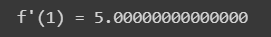

3. **Diferenciação Automática**
===============================

3.1. **Motivação**
------------------

Como já vimos nos capítulos anteriores, podemos classificar os tipos de derivações em 2 grupos:

1. Diferenciação analítica ou simbólica.
   
2. Diferenciação numérica.

Uma terceira opção surge ao estudarmos o método da diferenciação automática.

A diferenciação analítica nos permite derivar uma determinada função e ao final da operação encontrar a forma fechada da derivada, ou seja, uma expressão
matemática que vai simbolizar a derivada da função. Podemos calcular a derivada em um determinado ponto simplesmente ao substituirmos o ponto na expressão.
Já a derivação numérica vai nos fornecer uma aproximação da derivada em um ponto, não nos fornecendo uma forma fechada da derivada, ou seja, estamos estimando o limite da função em um determinado ponto quando nosso passo
:math:`h` tende a um valor estabelecido por nós.
Por fim, a diferenciação automática não é um tipo de técnica simbólica nem numérica. Ela faz parte de um outro grupo de métodos de diferenciação, chamada de diferenciação automática ou autodiferenciação (termo mais utilizado na area de machine learning).
A diferenciação automática baseia-se na decomposição de funções em operações básicas, cujas derivadas são conhecidas. Essas podem ser combinadas em um algoritmo para derivar a função em um determinado ponto. No resultado final vamos obter um valor 
numérico da derivada em um determinado ponto, nunca uma forma fechada da derivada, como a diferenciação analítica. Por não se basear em cálculos utilizando diferenças finitas, a diferenciação automática não possui erros de aproximação significativos, melhorando  muito a precisão do cálculo executado, contudo ainda
temos os erros de arredondamento presentes, visto que estes são inerentes aos cálculos computacionais.

Esse método facilita otimizações e análises avançadas em sistemas complexos, particularmente em redes neurais artificiais, onde a precisão e eficiência no cálculo de gradientes são essenciais.
A base teórica por trás de todo o método se baseia em o que chamamos de números duais.

3.2. **Números duais**
----------------------

Conceitos Básicos: Introduzir a definição e propriedades dos números duais.
Relação com Diferenciação Automática: Explicar como os números duais são usados para calcular derivadas de forma eficiente e precisa.

Os números duais são uma extensão dos números reais, similares aos números complexos, contudo possuem suas particularidades.
Os números complexos por exemplo são expressos no seguinte formato 

.. admonition:: Definição

    .. math::

        \begin{align}
        &z = x + yi \tag{73} \\ \\
        \end{align}

    Onde :math:`x` e :math:`y` são números reais e representam respectivamente as coordenadas  :math:`(x,y)` de um ponto no espaço  e :math:`i` é o que chamamos de unidade imaginária e tem em sua definição :math:`i=\sqrt{-1}` .

    Os números duais são definidos da seguinte forma 

    .. math::

        \begin{align}
        &a = a + a'd \tag{74} \\ \\
        \end{align}

    Onde :math:`a` é uma função avaliada em um determinado ponto, :math:`a'` é a derivada da função avaliada no ponto e :math:`d` é a unidade dual e é definida como :math:`d^2 = 0` .

    As regras aritméticas que regem o cálculo envolvendo números duais podem ser definidas como

 

    Dado o número dual :math:`a = (a+a'd)` e o número dual :math:`b=(b+b'd)` , temos

    Adição 

    .. math::

        \begin{align}
        &a + b = (a + a'd) + (b+b'd) = (a+b) + d(a'+b') \\ \\
        \end{align}

    Subtração 

    .. math::

        \begin{align}
        &a - b = (a + a'd) - (b+b'd) = (a-b) + d(a'-b') \\ \\
        \end{align}

    Multiplicação

    .. math::

        \begin{align}
        &a \times b = (a+a'd) \times (b+b'd) = (ab) + (ab'd) + (a'bd) + (a'b'd^2) = (ab) + d(ab' + a'b) \\ \\
        \end{align}

    Podemos notar que a primeira componente se comporta como a função avaliada no ponto e a segunda componente se comporta como a derivada 
    da função em um determinado ponto.

A essa altura podemos passar a escrever os números duas e suas operações em um formato de pares ordenados de números reais, 
deixando a variável dual :math:`d` de lado, uma vez que ela serve apenas para nos guiar a respeito de qual parcela da equação é responsável por representar a derivada de uma função 
em um determinado ponto.

Logo podemos escrever 

.. math::

    \begin{align}
    &a = (a,a') \\ \\
    \end{align}

.. admonition:: Regra de derivação para números duais 

    Por fim, podemos sintetizar as operações mais básicas envolvendo os números duais como 

    .. list-table::
        :widths: 45 45

        * - :math:`a + b = (a+b, a' + b')` 
          - :math:`a - b = (a-b, a' - b')` 
        * - :math:`a \times b = (ab, a'b + ab')` 
          - :math:`a / b = (\frac{a}{b}, \frac{a'b - ab'}{b^2} )`
        * - :math:`c = (c,0)` 
          - :math:`x = (x,1)` 

    Repare que, o valor de uma variável constante avaliada em um determinado ponto é a própria variável, e o valor de sua derivada é zero - como vimos no primeiro capítulo deste material.
    Para o caso da variável independente a mesma lógica é utilizada.

.. admonition:: Exemplo 

    Calcule a derivada da função :math:`f(x) = \frac{(x+2)(x-3)}{(x-4)}` no ponto :math:`x = 6`.

    O primeiro passo a se fazer é escrever a função e realizar os cálculos através das definições básicas apresentadas acima.

    Temos então

    .. math::

        \begin{align}
        &F(f(x),f'(x)) = (x+2) \times (x-3) / (x-4) = \\ \\
        &F(f(x),f'(x)) = {[(x,1) + (2,0)] \times [(x,1) - (3,0)]} / {[(x,1) - (4,0)]} \\ \\
        \end{align}
    
    Repare que buscamos encontrar :math:`f'(6)` .
    
    Logo, podemos substituir da seguinte forma 
    
    .. math::

        \begin{align}
        &F(f(6),f'(6)) = {[(6,1) + (2,0)] \times [(6,1) - (3,0)]} / {[(6,1) - (4,0)]} = \\ \\
        &F(f(6),f'(6)) = {[(8,1)] \times [(3,1)]} / {[(2,1)]} = \\ \\
        &F(f(6),f'(6)) = {[(8 \times 3, 1 \times 3 + 1 \times 8)]} / {[(2,1)]} = \\ \\
        &F(f(6),f'(6)) = {[(24, 11)]} / {[(2,1)]} = \\ \\
        &F(f(6),f'(6)) = {[24/2, (11 \times 2 - 24 \times 1)/2^2]} = \\ \\
        &F(f(6),f'(6)) = {[12,(22 - 24)/4]} = \\ \\
        &F(f(6),f'(6)) = {[12,-1/2]}
        \end{align}
    
    Que em sua essência nos diz a função e sua derivada no ponto :math:`x=6` . Logo, podemos concluir que :math:`F(6,1) = {[f(6) = 12, f'(6)=-1/2]}` .

Podemos ainda definir as regras de derivação por números duais para outras funções conhecidas, além de definirmos a regra da cadeia.

.. admonition:: Regra da cadeia e funções conhecidas 

    Iremos definir abaixo a regra da cadeia assim como a derivada de outras conhecidas funções
    através do uso dos números duais.

    .. list-table::
        :widths: 45 45

        * - Polinômios: :math:`p(a) = ((p(a), a'p'(a)))`  
          - Seno: :math:`sen(a) = sen((a,a'))=(sen(a),a'cos(a))` 
        * - Cosseno: :math:`cos(a) = cos((a,a'))=(cos(a),-a'sen(a))` 
          - Exponencial: :math:`e^{(a)} = e^{((a,a'))}=(e^{a},a'e^{a})`
        * - Logaritmo: :math:`ln(a) = ln((a,a'))=(ln(a),\frac{a'}{a})` 
          - Raiz quadrada: :math:`\sqrt{a}= \sqrt{((a,a'))}=(\sqrt{a},\frac{a'}{2\sqrt{a}})`     
  
    Repare que a regra da cadeia já está embutida nas expressões acima, mas podemos a definir como 

    .. math::

        \begin{align}
        &g(a) = g((a,a'))=(g(a,a'g'(a)))
        \end{align}

Podemos por fim resolver um exemplo um pouco mais elaborado afim de fixarmos as definições apresentadas acima.

.. admonition:: Exemplo 

    Dada a função a seguir :math:`f(x) = e^{sen(2x)}`, encontre sua derivada no ponto :math:`x=0.5` utilizando os números duais. 

    .. math::

        \begin{align}
        &F(f(x), f'(x)) = e^{sen((2,0) \times (x,1))} = \\ \\
        &F(f(0.5),f'(0.5)) = e^{sen((2,0) \times (0.5,1))} = \\ \\ 
        &F(f(0.5),f'(0.5)) = e^{sen(2 \times 0.5, 0 \times 0.5 + 2 \times 1)} = \\ \\
        &F(f(0.5),f'(0.5)) = e^{sen(1, 2)} = \\ \\ 
        &F(f(0.5),f'(0.5)) = (e^{sen(1)}, 2cos(1)e^{sen(1)}) = \\ \\
        &F(f(0.5),f'(0.5)) \approx [(2.3197768, 2.5067615)]
        \end{align}

A derivação via números duais ainda não é de fato a diferenciação automática em sua essência. Para diferenciarmos a função em um determinado ponto automaticamente precisamos de fato automatizar o processo.
É nítido que para expressões complexas o esforço matemático (para diferenciar uma determinada função utilizando os números duais) vai ser algo extremamente custoso, logo, visamos automatizar este processo de modo que um Script em Python seja capaz de realizar as tarefas apresentadas acima sem grandes problemas.
Na seção apresentada a seguir iremos criar nosso algoritmo de diferenciação automática.

3.3. **Implementando a autodiferenciação** 
------------------------------------------

Podemos implementar um código em Python de forma que as operações das derivadas via números duais possam ser de fato automatizadas.
O código apresentado carrega consigo alguns conceitos um pouco mais avançados dentro da area da programação. Por mais que no corpo do Script tenhamos várias
explicações/comentários do que cada escrita realiza no código, não se preocupe caso tenha alguma dúvida. O objetivo deste material não é ensinar programação.

Por fim, podemos apresentar o Script abaixo, onde a autodiferenciação foi implementada de fato.

Entrada:

.. code::

    import math  # Importa o módulo math para acessar funções matemáticas como cos, sin e log.

    class Dif:
        # Classe Dif para representar e operar com variáveis diferenciais.
        def __init__(self, p, d):
            self.p = p  # Valor primal: valor da função no ponto de interesse.
            self.d = d  # Primeira derivada: derivada da função no ponto de interesse.

        def __add__(self, other):
            # Método especial para sobrecarregar o operador de adição (+).
            if isinstance(other, Dif):
                # Se 'other' é uma instância de Dif, soma tanto os valores primais quanto as derivadas.
                return Dif(self.p + other.p, self.d + other.d)
            else:
                # Se 'other' é um número real, soma apenas aos valores primais.
                return Dif(self.p + other, self.d)

        def __mul__(self, other):
            # Método especial para sobrecarregar o operador de multiplicação (*).
            if isinstance(other, Dif):
                # Se 'other' é uma instância de Dif, aplica a regra do produto para a multiplicação.
                return Dif(self.p * other.p, self.p * other.d + self.d * other.p)
            else:
                # Se 'other' é um número real, multiplica pelo valor primal e pela derivada.
                return Dif(self.p * other, self.d * other)

        @staticmethod
        def cos(x):
            # Método estático para calcular o cosseno de uma variável diferencial.
            # Calcula o cosseno do valor primal e aplica a regra da cadeia para a derivada.
            return Dif(math.cos(x.p), -math.sin(x.p) * x.d)

        @staticmethod
        def log(x):
            # Método estático para calcular o logaritmo natural de uma variável diferencial.
            # Calcula o logaritmo do valor primal e aplica a regra da cadeia para a derivada.
            return Dif(math.log(x.p), 1/x.p * x.d)

    # Funções auxiliares para criar variáveis diferenciais representando constantes e variáveis
    def constante(a):
        # Retorna uma variável diferencial que representa uma constante (derivada é 0).
        return Dif(a, 0)

    def variavel(x):
        # Retorna uma variável diferencial que representa uma variável (derivada é 1).
        return Dif(x, 1)

    def f(x):
        # Define a função f(x) = x + cos(x) + x*log(x) usando as operações da classe Dif.
        # Utiliza os métodos estáticos da classe Dif para calcular cos e log.
        return x + Dif.cos(x) + x*Dif.log(x)

    # Escolha um ponto para calcular
    x_val = 1.5

    # Criar a variável diferencial para x
    x = variavel(x_val)

    # Calcular a função e a derivada
    resultado = f(x)
    print(f"f({x_val}) =", resultado.p)
    print(f"f'({x_val}) =", resultado.d)

Saída:

.. figure:: images/image_19.png
        
    Figura 19

Podemos ainda calcular a derivada simbólica da função afim de compararmos o resultado obtido. É importante entendermos que nem sempre isso será possível. Caso a função seja complexa demais, 
iremos utilizar como métrica a própria derivada numérica, apresentada no capítulo 2 deste material.

Entrada:

.. code::

    from sympy import symbols, cos, log, diff

    # Definir a variável simbólica
    x = symbols('x')

    # Definir a função f(x)
    f = x + cos(x) + x*log(x)

    # Calcular a derivada simbólica de f(x)
    f_prime = diff(f, x)

    # Avaliar a derivada em x = 1.5
    f_prime_val = f_prime.subs(x, 1.5).evalf()

    # Imprimir o resultado
    print("f'(1.5) =", f_prime_val)

Saída:

    Figura 20

É evidente que o resultado obtido com o uso do nosso algoritmo para diferenciar automaticamente uma função é exatamente o mesmo que a derivação simbólica nos fornece, 
nos mostrando que, de fato, ao calcularmos derivadas em pontos específicos, a autodiferenciação surge como uma forte opção para essa tarefa.

Podemos ainda falar sobre os dois principais modos de diferenciação automática. A diferenciação automática apresentada acima é conhecida como modo direto, 
no seção abaixo iremos entender a diferença entre os modos direto e reverso e quais suas consequências.

3.4. **Modo direto e reverso**
------------------------------

Definição e Diferenças: Explicar a diferença entre o modo direto (forward mode) e o modo reverso (reverse mode).

Aplicações: Discutir em quais cenários cada modo é mais eficiente (por exemplo, o modo reverso é frequentemente preferido em redes neurais profundas devido à sua eficiência no cálculo do gradiente).

3.5. **Bibliotecas de diferenciação automática**
------------------------------------------------

Visão Geral: Fornecer uma breve introdução sobre o que cada biblioteca oferece.

Comparação: Destacar as diferenças e semelhanças entre TensorFlow, PyTorch e JAX, incluindo suas abordagens para diferenciação automática.

Exemplos Práticos: Exemplos simples de como cada biblioteca implementa a diferenciação automática.

3.5.1. **TensorFlow**
~~~~~~~~~~~~~~~~~~~~~

Características Específicas: Discutir recursos únicos do TensorFlow, como seu sistema de grafos computacionais.

3.5.2. **JAX**
~~~~~~~~~~~~~~

Características Específicas: Destacar a capacidade do JAX de compilar funções Python para diferentes plataformas (CPU, GPU). Falar sobre JIT

Uma vez que entendemos como a técnica da diferenciação automática funciona e como podemos utilizar as principais bibliotecas disponíveis
, podemos de fato nos debruçar sobre suas aplicações dentro da area do machine learning, onde eu e meus orientadores, durante a minha graduação
resolvemos alguns problemas canônicos da Física utilizando este recurso.

Primeiramente, gostaria de trazer um exemplo um pouco mais simples, onde vamos de fato poder enxergar o potencial desta poderosa técnica, mas antes, precisamos entender 
alguns conceitos chaves, que serão apresentados abaixo.

3.6. **Aplicação em Machine Learning**
--------------------------------------

Falar sobre o caso em que precisamos minimizar a função custo. - Explicar como se dá uma rede neural artificial rapidamente.

Mostrar um exemplo mais simples de minimização.

Falar sobre meu trabalho de IC.

