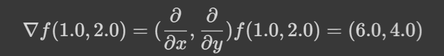

3. **Diferenciação Automática**
===============================

3.1. **Motivação**
------------------

Como já vimos nos capítulos anteriores, podemos classificar os tipos de derivações em 2 grupos:

1. Diferenciação analítica ou simbólica.
   
2. Diferenciação numérica.

Uma terceira opção surge ao estudarmos o método da diferenciação automática.

A diferenciação analítica nos permite derivar uma determinada função e ao final da operação encontrar a forma fechada da derivada, ou seja, uma expressão
matemática que vai simbolizar a derivada da função. Podemos calcular a derivada em um determinado ponto simplesmente ao substituirmos o ponto na expressão.
Já a derivação numérica vai nos fornecer uma aproximação da derivada em um ponto, não nos fornecendo uma forma fechada da derivada, ou seja, estamos estimando o limite da função em um determinado ponto quando nosso passo
:math:`h` tende a um valor estabelecido por nós.

De acordo com :ref:`Baydin [2018]<ref3>`, a diferenciação automática não é um tipo de técnica simbólica nem numérica. Ela faz parte de um outro grupo de métodos de diferenciação, chamada de diferenciação automática ou autodiferenciação (termo mais utilizado na área de machine learning).
A diferenciação automática baseia-se na decomposição de funções em operações básicas, cujas derivadas são conhecidas. Essas podem ser combinadas em um algoritmo para derivar a função em um determinado ponto. No resultado final vamos obter um valor 
numérico da derivada em um determinado ponto, nunca uma forma fechada da derivada, como a diferenciação analítica. Por não se basear em cálculos utilizando diferenças finitas, a diferenciação automática não possui erros de aproximação significativos, melhorando  muito a precisão do cálculo executado, contudo ainda
temos os erros de arredondamento presentes, visto que estes são inerentes aos cálculos computacionais.

Esse método facilita otimizações e análises avançadas em sistemas complexos, particularmente em redes neurais artificiais, onde a precisão e eficiência no cálculo de gradientes são essenciais.
A base teórica por trás de todo o método se baseia em o que chamamos de números duais.

3.2. **Números duais**
----------------------

O conceito por trás da diferenciação automática parte da definição dos números duais. Através dos números duais podemos escrever o valor de uma função em um ponto e sua derivada no ponto.

Os números duais são uma extensão dos números reais, similares aos números complexos, contudo possuem suas particularidades.
Os números complexos, por exemplo, são expressos no seguinte formato: 

.. admonition:: Definição

    .. math::

        \begin{align}
        &z = x + yi \tag{73} \\ \\
        \end{align}

    Onde :math:`x` e :math:`y` são números reais e representam respectivamente as coordenadas  :math:`(x,y)` de um ponto no espaço  e :math:`i` é o que chamamos de unidade imaginária e tem em sua definição :math:`i=\sqrt{-1}` .

    Os números duais são definidos da seguinte forma 

    .. math::

        \begin{align}
        &a = a + a'd \tag{74} \\ \\
        \end{align}

    Onde :math:`a` é uma função avaliada em um determinado ponto, :math:`a'` é a derivada da função avaliada no ponto e :math:`d` é a unidade dual e é definida como :math:`d^2 = 0` .

    As regras aritméticas que regem o cálculo envolvendo números duais podem ser definidas como:

 

    Dado o número dual :math:`a = (a+a'd)` e o número dual :math:`b=(b+b'd)` , temos

    Adição 

    .. math::

        \begin{align}
        &a + b = (a + a'd) + (b+b'd) = (a+b) + d(a'+b') \tag{75} \\ \\
        \end{align}

    Subtração 

    .. math::

        \begin{align}
        &a - b = (a + a'd) - (b+b'd) = (a-b) + d(a'-b') \tag{76} \\ \\
        \end{align}

    Multiplicação

    .. math::

        \begin{align}
        &a \times b = (a+a'd) \times (b+b'd) = (ab) + (ab'd) + (a'bd) + (a'b'd^2) = (ab) + d(ab' + a'b) \tag{77} \\ \\
        \end{align}

    Podemos notar que a primeira componente se comporta como a função avaliada no ponto e a segunda componente se comporta como a derivada 
    da função em um determinado ponto.

A essa altura podemos passar a escrever os números duas e suas operações em um formato de pares ordenados de números reais, 
deixando a variável dual :math:`d` de lado, uma vez que ela serve apenas para nos guiar a respeito de qual parcela da equação é responsável por representar a derivada de uma função 
em um determinado ponto.

Logo podemos escrever 

.. math::

    \begin{align}
    &a = (a,a') \tag{78} \\ \\
    \end{align}

.. admonition:: Regra de derivação para números duais 

    Por fim, podemos sintetizar as operações mais básicas envolvendo os números duais como 

    .. list-table::
        :widths: 45 45

        * - :math:`a + b = (a+b, a' + b')` 
          - :math:`a - b = (a-b, a' - b')` 
        * - :math:`a \times b = (ab, a'b + ab')` 
          - :math:`a / b = (\frac{a}{b}, \frac{a'b - ab'}{b^2} )`
        * - :math:`c = (c,0)` 
          - :math:`x = (x,1)` 

    Repare que, o valor de uma variável constante avaliada em um determinado ponto é a própria variável, e o valor de sua derivada é zero -- como vimos no primeiro capítulo deste material.
    Para o caso da variável independente, a mesma lógica é utilizada.

.. admonition:: Exemplo 

    Calcule a derivada da função :math:`f(x) = \frac{(x+2)(x-3)}{(x-4)}` no ponto :math:`x = 6`.

    O primeiro passo a se fazer é escrever a função e realizar os cálculos através das definições básicas apresentadas acima.

    Temos então

    .. math::

        \begin{align}
        &F(f(x),f'(x)) = (x+2) \times (x-3) / (x-4) = \\ \\
        &F(f(x),f'(x)) = {[(x,1) + (2,0)] \times [(x,1) - (3,0)]} / {[(x,1) - (4,0)]} \\ \\
        \end{align}
    
    Repare que buscamos encontrar :math:`f'(6)` .
    
    Logo, podemos substituir da seguinte forma 
    
    .. math::

        \begin{align}
        &F(f(6),f'(6)) = {[(6,1) + (2,0)] \times [(6,1) - (3,0)]} / {[(6,1) - (4,0)]} = \\ \\
        &F(f(6),f'(6)) = {[(8,1)] \times [(3,1)]} / {[(2,1)]} = \\ \\
        &F(f(6),f'(6)) = {[(8 \times 3, 1 \times 3 + 1 \times 8)]} / {[(2,1)]} = \\ \\
        &F(f(6),f'(6)) = {[(24, 11)]} / {[(2,1)]} = \\ \\
        &F(f(6),f'(6)) = {[24/2, (11 \times 2 - 24 \times 1)/2^2]} = \\ \\
        &F(f(6),f'(6)) = {[12,(22 - 24)/4]} = \\ \\
        &F(f(6),f'(6)) = {[12,-1/2]}
        \end{align}
    
    Que em sua essência nos diz a função e sua derivada no ponto :math:`x=6` . Logo, podemos concluir que :math:`F(6,1) = {[f(6) = 12, f'(6)=-1/2]}` .

Podemos ainda definir as regras de derivação por números duais para outras funções conhecidas, além de definirmos a regra da cadeia.

.. admonition:: Regra da cadeia e funções conhecidas 

    Iremos definir abaixo a regra da cadeia assim como a derivada de outras funções conhecidas através do uso dos números duais.

    .. list-table::
        :widths: 45 45

        * - Polinômios: :math:`p(a) = ((p(a), a'p'(a)))`  
          - Seno: :math:`sen(a) = sen((a,a'))=(sen(a),a'cos(a))` 
        * - Cosseno: :math:`cos(a) = cos((a,a'))=(cos(a),-a'sen(a))` 
          - Exponencial: :math:`e^{(a)} = e^{((a,a'))}=(e^{a},a'e^{a})`
        * - Logaritmo: :math:`ln(a) = ln((a,a'))=(ln(a),\frac{a'}{a})` 
          - Raiz quadrada: :math:`\sqrt{a}= \sqrt{((a,a'))}=(\sqrt{a},\frac{a'}{2\sqrt{a}})`     
  
    Repare que a regra da cadeia apresentada no capítulo 1 deste material, já está embutida nas expressões acima, mas podemos a definir como 

    .. math::

        \begin{align}
        &g(a) = g((a,a'))=(g(a,a'g'(a)))
        \end{align}

Podemos, por fim, resolver um exemplo um pouco mais elaborado afim de fixarmos as definições apresentadas acima.

.. admonition:: Exemplo 

    Dada a função a seguir :math:`f(x) = e^{sen(2x)}`, encontre sua derivada no ponto :math:`x=0.5` utilizando os números duais. 

    .. math::

        \begin{align}
        &F(f(x), f'(x)) = e^{sen((2,0) \times (x,1))} = \\ \\
        &F(f(0.5),f'(0.5)) = e^{sen((2,0) \times (0.5,1))} = \\ \\ 
        &F(f(0.5),f'(0.5)) = e^{sen(2 \times 0.5, 0 \times 0.5 + 2 \times 1)} = \\ \\
        &F(f(0.5),f'(0.5)) = e^{sen(1, 2)} = \\ \\ 
        &F(f(0.5),f'(0.5)) = (e^{sen(1)}, 2cos(1)e^{sen(1)}) = \\ \\
        &F(f(0.5),f'(0.5)) \approx [(2.3197768, 2.5067615)]
        \end{align}

Podemos ainda extrapolar o cálculo de uma variável praticado até o presente momento justificado por fins didáticos. Vamos considerar uma função de várias variáveis do tipo :math:`f(x,y,z)` e, ao aplicarmos as mesmas regras apresentadas, obtemos os mesmos resultados discutidos.

A diferença é que não estamos mais calculando derivadas totais sob as parcelas de cada eixo, e sim derivadas parciais. Isso se torna útil em um contexto voltado ao machine learning, onde muitas vezes vamos calcular gradientes de funções, que pode ser definido como:

.. math::

    \begin{align}
    &\vec{\nabla} f(x,y,z) = \frac{\partial}{\partial x}f(x,y,z) \hat{x} + \frac{\partial}{\partial y}f(x,y,z) \hat{y} + \frac{\partial}{\partial z}f(x,y,z) \hat{z} \tag{79} \\ \\
    \end{align}

Por fim, a derivação via números duais ainda não é de fato a diferenciação automática em sua essência. Para diferenciarmos a função em um determinado ponto automaticamente precisamos de fato automatizar o processo.
É nítido que para expressões complexas o esforço matemático (para diferenciar uma determinada função utilizando os números duais) vai ser algo extremamente custoso, logo, visamos automatizar o processo de modo que um algoritmo em Python seja capaz de realizar as tarefas apresentadas acima sem grandes problemas.

Na seção apresentada a seguir iremos criar nosso algoritmo de diferenciação automática.

3.3. **Implementando a autodiferenciação** 
------------------------------------------

Podemos implementar um código em Python de forma que as operações das derivadas via números duais possam ser de fato automatizadas.
A ideia central é "quebrar" uma determinada função matemática em várias partes cuja derivada possa ser escrita com as regras apresentadas acima.

O código apresentado carrega consigo alguns conceitos um pouco mais avançados dentro da área da programação, como é o caso do uso de classes, objetos e sobrecarga de operadores (operators overloading).

Uma tentativa de didatizar o conteúdo é através de comentários no corpo do código e de uma breve explicação ao final. De qualquer forma, não se preocupe caso tenha alguma dúvida. O objetivo deste material não é ensinar programação de fato.

Por fim, podemos apresentar o algoritmo abaixo, onde a autodiferenciação foi implementada de fato.

O primeiro exemplo se trata de calcularmos a derivada da função :math:`f(x) = x^5 + 1 ` no ponto :math:`x = 1`

Entrada:

.. code::

    import math  # Importa o módulo math para acessar funções matemáticas.

    class Dif:
    # Classe Dif para representar e operar com variáveis diferenciais.
    def __init__(self, p, d):
        self.p = p  # Valor primal: valor da função no ponto de interesse.
        self.d = d  # Primeira derivada: derivada da função no ponto de interesse.

    # Sobrecarrega o operador de adição.
    def __add__(self, other):
        if isinstance(other, Dif):
            # Soma os valores primais e as derivadas se 'other' for uma instância de Dif.
            return Dif(self.p + other.p, self.d + other.d)
        else:
            # Soma um número real ao valor primal se 'other' for um número.
            return Dif(self.p + other, self.d)

    # Sobrecarrega o operador de adição para permitir adição comutativa (número + objeto Dif).
    def __radd__(self, other):
        if isinstance(other, Dif):
            # Soma os valores primais e as derivadas se 'other' for uma instância de Dif.
            return Dif(self.p + other.p, self.d + other.d)
        else:
            # Soma um número real ao valor primal se 'other' for um número.
            return Dif(self.p + other, self.d)

    # Sobrecarrega o operador de multiplicação.
    def __mul__(self, other):
        if isinstance(other, Dif):
            # Aplica a regra do produto para multiplicação.
            return Dif(self.p * other.p, self.p * other.d + self.d * other.p)
        else:
            # Multiplica um número real pelo valor primal e pela derivada.
            return Dif(self.p * other, self.d * other)

    # Sobrecarrega o operador de multiplicação para permitir multiplicação comutativa.
    def __rmul__(self, other):
        if isinstance(other, Dif):
            # Aplica a regra do produto para multiplicação.
            return Dif(self.p * other.p, self.p * other.d + self.d * other.p)
        else:
            # Multiplica um número real pelo valor primal e pela derivada.
            return Dif(self.p * other, self.d * other)

    # Sobrecarrega o operador de subtração.
    def __sub__(self, other):
        if isinstance(other, Dif):
            # Subtrai os valores primais e as derivadas se 'other' for uma instância de Dif.
            return Dif(self.p - other.p, self.d - other.d)
        else:
            # Subtrai um número real do valor primal.
            return Dif(self.p - other, self.d)

    # Sobrecarrega o operador de subtração para permitir subtração comutativa (número - objeto Dif).
    def __rsub__(self, other):
        if isinstance(other, Dif):
            # Subtrai os valores primais e as derivadas se 'other' for uma instância de Dif.
            return Dif(self.p - other.p, self.d - other.d)
        else:
            # Subtrai um número real do valor primal.
            return Dif(self.p - other, self.d)

    # Sobrecarrega o operador de divisão.
    def __truediv__(self, other):
        if isinstance(other, Dif):
            # Aplica a regra da divisão para a divisão de Difs.
            return Dif(self.p / other.p, (self.d * other.p - self.p * other.d) / (other.p ** 2))
        else:
            # Divide um número real pelo valor primal e pela derivada.
            return Dif(self.p / other, self.d / other)

    # Sobrecarrega o operador de divisão para permitir divisão comutativa (número / objeto Dif).
    def __rtruediv__(self, other):
        if isinstance(other, Dif):
            # Aplica a regra da divisão para a divisão de Difs.
            return Dif(self.p / other.p, (self.d * other.p - self.p * other.d) / (other.p ** 2))
        else:
            # Divide um número real pelo valor primal e pela derivada.
            return Dif(self.p / other, self.d / other)

    # Sobrecarrega o operador de potência '**'.
    def __pow__(self, other):
        if isinstance(other, int):
            # Verifica se o expoente é um inteiro.
            # Calcula x^other, onde 'x' é o valor primal do objeto Dif e 'other' é o expoente.
            new_primal = self.p ** other
            new_derivative = other * (self.p ** (other - 1)) * self.d
            return Dif(new_primal, new_derivative)
        else:
            # Lança um erro se o expoente não for um inteiro.
            raise TypeError("Potência só suportada para expoentes inteiros.")

    # Funções auxiliares para criar uma variável diferencial como uma constante ou uma variável.
    def constante(a):
        return Dif(a, 0)  # Retorna um objeto Dif com derivada 0.

    def variavel(x):
        return Dif(x, 1)  # Retorna um objeto Dif com derivada 1.

    # Função de exemplo que aceita múltiplas variáveis diferenciais.
    def f(x):
        # Calcula a função f(x) = (x**5 + 1)
        return (x**5 + 1)
    # Ponto de interesse x =1 .
    x = 1

    # Exibe a derivada da função f no ponto de interesse.
    print(f"df/dx f({x}) = {f(Dif(x,1)).d}")

Saída:

.. figure:: images/image_19.png
        
    Figura 19

Repare que a classe Dif é projetada para trabalhar com variáveis diferenciais e realizar operações aritméticas básicas, mantendo o controle do valor da função (valor primal) e sua derivada em um ponto específico.

A classe "Dif" representa uma variável diferencial. Cada instância possui dois atributos:

-   p: Valor primal, que é o valor da função no ponto de interesse.
-   d: Derivada da função no ponto de interesse.

A classe sobrecarrega vários operadores aritméticos para permitir operações entre objetos Dif ou entre um objeto Dif e um número real:

-  __add__ e __radd__: Adição comutativa.
-  __sub__ e __rsub__: Subtração comutativa.
-  __mul__ e __rmul__: Multiplicação comutativa.
-  __truediv__ e __rtruediv__: Divisão comutativa.
-  __pow__: Potência (apenas para expoentes inteiros).

Essas operações são realizadas de maneira que tanto o valor primal quanto a derivada possam ser corretamente calculadas seguindo as regras do cálculo diferencial apresentados nas seções acima.

Métodos Auxiliares - constante e variável:

-  Constante(a): Cria uma variável diferencial que representa uma constante (derivada zero).
-  Variável(x): Cria uma variável diferencial que representa uma variável independente (derivada um).

Por fim, o código define uma função :math:`f(x)` que calcula :math:`f(x) = (x^5 + 1)` . Em seguida, cria objetos Dif para :math:`x`  com 
valores específicos e calcula o valor da função :math:`f`  e sua derivada nesses pontos. Finalmente, imprime o valor da função (resultado.p) e o valor da derivada (resultado.d) para os valores dados de :math:`x` .

Podemos ainda calcular a derivada simbólica da função afim de compararmos o resultado obtido. É importante entendermos que nem sempre isso será possível. Caso a função seja complexa demais, podemos utilizar como métrica a própria derivada numérica, apresentada no capítulo 2 deste material.

Entrada:

.. code::

    from sympy import symbols, diff

    # Definir a variável simbólica
    x = symbols('x')

    # Definir a função f(x)
    f = (x**5 + 1)

    # Calcular a derivada simbólica de f(x)
    f_prime = diff(f, x)

    # Avaliar a derivada em x = 1
    f_prime_val = f_prime.subs(x, 1).evalf()

    # Imprimir o resultado
    print("f'(1) =", f_prime_val)

Saída:

.. figure:: images/image_20.png

    Figura 20

Podemos observar que o resultado obtido com o uso do nosso algoritmo para diferenciar automaticamente a função é exatamente o mesmo que a derivação simbólica nos fornece, nos mostrando que, de fato, ao calcularmos derivadas em pontos específicos, a autodiferenciação surge como uma forte alternativa para essa tarefa.

Vamos ainda resolver outro exemplo, onde a função a ser derivada é uma função de duas variáveis, no formato :math:`f(x,y) = y(x^5 + 1)` , onde buscamos encontrar o gradiente da função, ou seja, :math:`\vec{\nabla} f(x,y) = \frac{\partial }{\partial x} f(x,y) \hat{x} + \frac{\partial }{\partial y} f(x,y) \hat{y}` nos pontos :math:`x = 1 e y = 3`.

O algoritmo apresentado abaixo segue o mesmo processo do exemplo anterior, contudo estamos considerando mais variáveis. 

Entrada:

.. code::

    [...]

    # Função de exemplo que aceita múltiplas variáveis diferenciais.
    def f(x, y):
        # Calcula a função f(x, y) = y(x**5 + 1)
        return y*(x**5 + 1)

    # Ponto de interesse x = 1 e y = 3. 
    x, y = 1, 3

    # Exibe a derivada da função f no ponto de interesse.
    print(f"df/dx f({x},{y}) = {f(Dif(x,1), Dif(y,0)).d}")
    print(f"df/dy f({x},{y}) = {f(Dif(x,0), Dif(y,1)).d}")

Saída:

.. figure:: images/image_21.png

    Figura 21

É nítido que nosso algoritmo é uma implementação simplificada. Você pode notar que não definimos funções auxiliares como seno, cosseno, tangente, exponencial ou logaritmo, por exemplo, logo, estamos limitados dentro das possibilidades de funções existentes.

Isso foi feito como uma medida de simplificar o algoritmo em si, tornando-o mais didático e menos denso. Outro ponto interessante é que para derivadas de ordens superiores a implementação não é tão simples, logo, 
é necessário o uso de bibliotecas especializadas em diferenciação automática.

Dentro do grande universo da linguagem Python, existem bibliotecas que diferenciam automaticamente funções, onde estes algoritmos já estão implementados. Na seção 3.5 iremos falar melhor sobre uma das bibliotecas utilizadas: a biblioteca JAX.

Vamos ainda discutir os dois principais modos de diferenciação automática. A diferenciação automática apresentada acima é conhecida como modo direto, 
na seção abaixo iremos entender a diferença entre os modos direto e reverso e quais suas consequências.

3.4. **Modo direto e reverso**
------------------------------

Existem dois modos principais de diferenciação automática: o modo direto (forward accumulation) e o modo reverso (reverse accumulation). 

**Modo Direto (Forward Accumulation)**: 

Neste modo, a diferenciação é realizada da parte interna para a parte externa da função. Isso significa que as derivadas são calculadas seguindo a ordem das operações como elas aparecem no algoritmo. Por exemplo, se uma função é composta como 
:math:`f(g(h(x)))`, a diferenciação começa com :math:`h(x)` , seguida por  :math:`g(h(x))`, e finalmente :math:`f(g(h(x)))`. Este modo é eficiente quando há um pequeno número de variáveis independentes em relação às quais as derivadas são calculadas, 
pois para cada variável independente é necessário uma aplicação do algoritmo.

**Modo Reverso (Reverse Accumulation)**: 

Este modo funciona de maneira oposta ao modo direto. A diferenciação é realizada da parte externa para a parte interna. Primeiro, calcula-se a derivada da função externa e, em seguida, propaga-se essa informação para as funções internas. Usando o mesmo exemplo de 
:math:`f(g(h(x)))`, começaríamos com a derivada de :math:`f`, seguida por :math:`g` e :math:`h`. O modo reverso é particularmente eficiente quando há muitas variáveis independentes, pois permite calcular as derivadas em relação a todas essas variáveis em apenas uma aplicação do algoritmo.

Em resumo, a escolha entre o modo direto e o modo reverso depende da estrutura da função e do número de variáveis independentes. O modo direto é mais eficiente para funções com poucas variáveis independentes, enquanto o modo reverso é mais adequado para funções com muitas variáveis independentes.

A grande maioria das bibliotecas de diferenciação automática escolhem por conta própria (automaticamente) se o modo utilizado será o direto ou o reverso, logo, não é estritamente necessário um estudo rigoroso sobre os dois modos para se utilizar as biblioteca em si. Contudo, caso o leitor queira se aventurar, sugiro a leitura das referências :ref:`4 e 5<ref4>` que tratam de forma mais aprofundada a implementação do modo reverso e direto.

3.5. **Bibliotecas de diferenciação automática**
------------------------------------------------

Como já discutido, a diferenciação automática é uma técnica crucial em aprendizado de máquina, especialmente em redes neurais artificiais, 
permitindo o cálculo eficiente de gradientes e derivadas. 

Podemos citar três bibliotecas populares que implementam essa técnica. São elas: TensorFlow, PyTorch e JAX. Cada qual possui características únicas que as tornam adequadas para diferentes tipos de tarefas e abordagens. O objetivo aqui é apresentar a sintaxe da biblioteca JAX, além 
de discorrer um pouco sobre as funcionalidades da mesma.

3.5.1. **JAX**
~~~~~~~~~~~~~~

A biblioteca JAX, desenvolvida pela Google Research, é uma biblioteca que combina NumPy, Auto Diferenciação e aceleração de hardware. 
O que a torna especial é sua capacidade de transformar funções Python puras em funções que podem ser aceleradas em CPUs, GPUs e TPUs.

A biblioteca particularmente trabalha analisando o código da função Python e o converte em um formato intermediário que pode ser otimizado.
Durante essa conversão, ela aplica várias transformações, como fusão de operações, eliminação de operações redundantes e paralelização.

Após a transformação, ela utiliza o XLA (Accelerated Linear Algebra) para compilar este formato intermediário em código de máquina de alto desempenho. O XLA é um compilador avançado que otimiza o código para execução específica em CPUs, GPUs ou TPUs.
Essa compilação é feita de forma Just-In-Time (JIT), ou seja, ocorre em tempo de execução, permitindo que a JAX otimize o código com base no contexto específico em que está sendo executado.
O resultado final é uma versão da função original que pode ser executada muito mais rapidamente do que o código Python puro. Isso pode ser bastante útil para operações com muitos cálculos, como em machine learning e em processamento de grandes conjuntos de dados e simulações.
O XLA e a compilação JIT são particularmente úteis quando a função é executada em um hardware especializado, como GPUs e TPUs, que são projetados para lidar eficientemente com operações de alta intensidade computacional.

Para o usuário final, isso significa que é possível escrever funções em Python, uma linguagem de alto nível e fácil de usar, e ainda assim aproveitar o desempenho de baixo nível que normalmente requereria programação em uma linguagem mais complexa e de baixo nível, como C, por exemplo.
Além disso, essa abordagem permite que os cientistas de dados e pesquisadores se concentrem mais na modelagem e na lógica do problema, sem se preocuparem tanto com os detalhes de otimização de desempenho.

Abaixo iremos apresentar 2 exemplos do funcionamento da biblioteca e como se dá sua sintaxe no contexto da diferenciação automática. Primeiro vamos resolver o caso em que 
queremos calcular :math:`f'(x)` , onde :math:`f(x) = x(x+1)` no ponto :math:`x=1` .

Entrada:

.. code::

    import jax
    import jax.numpy as jnp

    #Define a função que queremos utilizar
    def f(x):
        return x * (x + 1)

    # Calculando o gradiente da função
    grad_f = jax.grad(f, argnums=(0))

    # Ponto em que o gradiente será calculado
    x = 1.0

    # Calculando o gradiente no ponto (x=1)
    grad_no_ponto = grad_f(x)

    #Mostra o resultado do gradiente no ponto.
    print("O gradiente de f no ponto (x=1) é:", grad_no_ponto)

Saída:

.. figure:: images/image_22.png

    Figura 22

Repare que para o usuário final o que de fato importa é a sintaxe 

.. code::

    grad_f = jax.grad(f, argnums=(0))

onde todo o resto do código está em Python puro, ou seja, a biblioteca JAX é utilizada neste caso, única
e exclusivamente para se calcular o gradiente da função fornecida.

Um segundo exemplo pode ser apresentado, onde a ideia é calcular o gradiente de uma função de duas ou três variáveis. No caso apresentado, vamos calcular o gradiente da função :math:`f(x,y) = x(x+y^2)` nos pontos :math:`x = 1; y= 2` .

Entrada:

.. code::

    #Importa as bibliotecas
    import jax
    import jax.numpy as jnp
    

    #Define a função
    def f(x, y):
        return x * (x + y**2)

    # Calculando o gradiente da função
    grad_f = jax.grad(f, argnums=(0, 1))

    # Ponto em que o gradiente será calculado
    x = 1.0
    y = 2.0

    # Calculando o gradiente no ponto (x=1, y=2)
    grad_no_ponto = grad_f(x, y)

    #Mostra o resultado do gradiente no ponto.
    print("O gradiente de f no ponto (x=1, y=2) é:", grad_no_ponto)

Saída:

    Figura 23

A diferença ao calcularmos o gradiente de funções de uma, duas ou até quantas variáveis quisermos, vai ser evidente na linha em que chamamos a função:

.. code::

    jax.grad(f, argnums = (0,1))

Se estivermos tratando de 3 variáveis por exemplo, utilizaríamos

.. code::
    
    jax.grad(f, argnums = (0, 1, 2))

Uma vez que entendemos como a técnica da diferenciação automática funciona e como podemos utilizar a biblioteca JAX para o cálculo de gradientes, podemos de fato mostrar suas aplicações dentro da área do machine learning, onde eu e meus orientadores (Daniel Silva e João Teles), durante a minha graduação utilizamos destas ferramentas para resolver alguns conhecidos problemas da Física.

A próxima sessão surge com a ideia de tocarmos de forma suave na definição de redes neurais artificiais e de algumas propriedades que a tangem, como: 
função custo, taxa de aprendizagem, pesos sinápticos, bias, etc,  e então apresentar um exemplo menos sofisticado, onde vamos de fato poder enxergar o potencial desta
poderosa técnica que está intimamente relacionada com a diferenciação automática.

3.6. **Aplicação em Redes Neurais Artificiais**
-----------------------------------------------

Redes Neurais Artificiais (RNAs) são sistemas computacionais inspirados no funcionamento do cérebro humano, projetados para aprender e processar informações de maneira análoga 
aos seres humanos. Estas redes são formadas por unidades de processamento chamadas neurônios artificiais, que estão interconectados e trabalham em conjunto para resolver problemas 
específicos.

O treinamento de uma RNA é guiado por uma função custo (ou função de perda - :math:`L(w,b)` ), que avalia o desempenho da rede. Esta função custo vai depender do sistema em questão que queremos treinar e otimizar, mas ela sempre vai
depender no mínimo de parâmetros conhecidos como peso sináptico e bias.

O objetivo do treinamento é minimizar a função custo, nos indicando que a rede está aprendendo efetivamente. O algoritmo de gradiente descendente é utilizado para 
minimizar a função custo. Ele ajusta iterativamente os pesos :math:`w` e o bias :math:`b` da rede na direção que reduz o erro. 
O processo de atualização em cada iteração é dado por:

.. math::

    \begin{align}
    &w_{novo} = w_{antigo} -\alpha \frac{\partial }{\partial w} L \tag{80} \\ \\
    &b_{novo} = b_{antigo} -\alpha \frac{\partial }{\partial b} L \tag{81} \\ \\
    \end{align}

Aqui, :math:`\alpha` representa o learning rate, um hiperparâmetro que controla o tamanho do passo na atualização dos parâmetros. 
Um learning rate muito alto pode causar oscilações em torno do mínimo da função custo, enquanto um learning rate muito baixo pode resultar em um processo de treinamento lento. 
Caso o leitor se interesse pelas expressões acima, fica como leitura complementar a referência :ref:`[6]<ref6>` .

A autodiferenciação, como já apresentado, é uma técnica matemática que permite calcular automaticamente as derivadas e os gradientes de funções, sendo essencial no processo da otimização via uso do gradiente descendente. 
Ela facilita o cálculo dos gradientes da função custo em relação a cada peso :math:`w` e :math:`b`, permitindo a atualização eficiente desses parâmetros.

Na prática, ao treinar uma RNA, começamos com pesos :math:`w` e bias :math:`b` inicializados aleatoriamente. Utilizamos o gradiente descendente para minimizar a função custo 
:math:`L(w,b)` . Em cada etapa do treinamento, calculamos o gradiente da função custo em relação a cada parâmetro, ajustamos esses parâmetros na direção oposta ao gradiente 
(para diminuir o erro - por isso o sinal negativo), e repetimos o processo. O treinamento prossegue até que a função custo alcance um valor mínimo, indicando que a rede aprendeu a tarefa desejada de forma eficiente.

A imagem abaixo representa o funcionamento de uma rede neural artificial onde a arquitetura da rede é composta pela camada de entrada, camada escondida e camada de saída. 
A camada escondida possui 100 neurônios artificiais enquanto as outras duas apenas um. A arquitetura da rede é um parâmetro empírico que necessita de testes, assim como alguns dos hiperparâmetros.

    Figura 24

Para essa rede neural em especifico, a função custo depende da equação diferencial e das condições de contorno do problema (poço de potencial infinito unidimensional).
Logo, se trata de um problema um pouco mais complexo, uma vez que estamos de fato utilizando uma rede neural artificial para resolver uma equação diferencial, dada as condições de contorno do sistema. A essa area de intersecção entre a Física e o machine learning, se dá o nome de 
PINNS (Physics Informed Neural Networks) , ou seja, "informamos" a Física do problema via função custo para a rede neural afim de que após o treinamento ela possa nos dar uma solução para a equação diferencial apresentada.

Não estamos interessados em tratar de equações diferenciais, nem de criarmos nenhuma rede neural artificial neste trabalho, visto que a abordagem teórica adotada nos capítulos anteriores não trata de fato de equações diferenciais, contudo, podemos trazer um exemplo em que simulamos o processo
de aprendizado de uma rede neural artificial, com o objetivo de elucidarmos o uso da autodiferenciação para minimizar uma função custo. (Entretanto, caso haja interesse pelo tema, fica a cargo do leitor o estudo das referências :ref:`6 e 7<ref7>` ).

Através de um algoritmo em Python e da biblioteca JAX, iremos minimizar uma função custo que vai depender do peso sináptico (:math:`w` ) e do bias (:math:`b` ).

Este código exemplifica um processo básico de otimização em aprendizado de máquina, onde uma função de custo é minimizada ajustando iterativamente os parâmetros (pesos) da rede.

Por fim, podemos apresentar o algoritmo e discorrer sobre seu significado e resultados.

Entrada:

.. code::

    import jax.numpy as jnp
    from jax import grad
    import matplotlib.pyplot as plt

    # Função para atualizar os pesos subtraindo o gradiente multiplicado pela taxa de aprendizado
    def atualizar_pesos(pesos, gradientes, taxa_aprendizado):
        return pesos - taxa_aprendizado * gradientes

    # Função custo quadrática
    def funcao_custo(pesos):
        return jnp.sum(pesos**2)

    # Inicialização dos pesos
    pesos = jnp.array([1.0, -2.0])

    # Definição da taxa de aprendizado
    taxa_aprendizado = 0.1

    # Preparação da função para calcular o gradiente da função de custo
    grad_funcao_custo = grad(funcao_custo)

    # Lista para armazenar os valores do custo para posterior visualização
    valores_custo = []

    # Loop de treinamento para atualizar os pesos
    for i in range(100):
        # Calcula o gradiente da função de custo
        gradientes = grad_funcao_custo(pesos)

        # Atualiza os pesos
        pesos = atualizar_pesos(pesos, gradientes, taxa_aprendizado)

        # Calcula e armazena o custo atual
        custo_atual = funcao_custo(pesos)
        valores_custo.append(custo_atual)

    # Plotando o gráfico do custo ao longo das iterações
    plt.plot(valores_custo, marker='.')
    plt.title('Custo em relação a epoch')
    plt.xlabel('Epoch')
    plt.ylabel('Custo')
    plt.show()

Saída:

.. figure:: images/image_25.png

    Figura 25

O código acima ilustra o processo de otimização de parâmetros (pesos) de forma simplificada, usando gradiente descendente e a biblioteca JAX para autodiferenciação.

Começamos importando as bibliotecas necessárias.

A função **atualizar_pesos** é definida para ajustar os pesos. Ela recebe os pesos iniciais, os gradientes desses pesos e uma taxa de aprendizado. 
Os pesos são atualizados subtraindo o produto do gradiente pelo valor da taxa de aprendizado. Este é um passo fundamental no gradiente descendente, um método comum para otimização em machine learning.
A função **funcao_custo** calcula o custo  com base nos pesos atuais. No nosso caso, a função custo é simplesmente a soma dos quadrados dos pesos. 
O objetivo é minimizar essa função custo ajustando os pesos.
Os pesos são inicializados com valores específicos, e uma taxa de aprendizado é definida. A taxa de aprendizado determina o tamanho dos passos que são 
dados na direção oposta ao gradiente durante a otimização.

Utilizamos a função **grad** da biblioteca JAX, o gradiente da função custo é preparado para ser calculado automaticamente. Isso permite que o código 
calcule os gradientes necessários para a atualização dos pesos sem a necessidade de derivadas manuais ou numéricas.
O algoritmo executa um loop de otimização, onde em cada iteração (epoch), os gradientes são calculados e os pesos são atualizados. 
O valor da função custo é recalculado após cada atualização de peso e armazenado em listas para plotagem.
Após o loop de otimização, o código plota um gráfico mostrando como o valor da função custo diminuiu ao longo das iterações. 
Este gráfico é útil para visualizar o progresso da otimização e confirmar que a função custo está de fato sendo minimizada.

Em resumo, o código demonstra um exemplo básico de como os pesos podem ser otimizados usando o gradiente descendente. 
O foco está em mostrar como os pesos influenciam o valor da função custo e como eles podem ser ajustados iterativamente para minimizar 
esse custo. Embora o exemplo seja simplificado e não esteja ligado a uma aplicação de aprendizado de máquina específica, ele fornece uma base 
conceitual para entender a otimização de parâmetros em contextos mais complexos.

